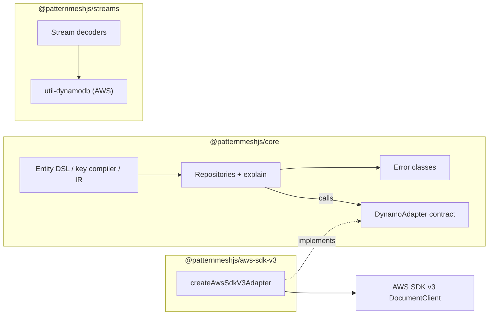

# Repo architecture

## Workspace topology

patternmesh is a `pnpm` workspace with three published packages:

```text
packages/
  core/                  # @patternmeshjs/core   — DSL, IR, compiler, repositories, transactions, relations
  adapter-aws-sdk-v3/    # @patternmeshjs/aws-sdk-v3 — DocumentClient adapter
  streams/               # @patternmeshjs/streams — typed stream decoding
docs/
  guides/                # user cookbook
  design/                # conceptual design docs (single-table, table setup, TypeDoc)
  dev/                   # this folder
scripts/
  build-site.mjs         # composes Pages site from markdown + TypeDoc output
tests-smoke/
  smoke.mjs              # consume-from-tarball harness
```

Workspace membership is declared in [`pnpm-workspace.yaml`](../../pnpm-workspace.yaml):

```yaml
packages:
  - "packages/*"
```

## Package boundaries



### Hard rules

- **`@patternmeshjs/core` has zero AWS SDK dependencies.** It defines a
  `DynamoAdapter` interface and nothing more about the outside world.
- **`@patternmeshjs/aws-sdk-v3` depends on `core` only as a workspace
  dependency.** It contains one exported factory, `createAwsSdkV3Adapter`, and
  a thin `DynamoAdapter` implementation over `@aws-sdk/lib-dynamodb`.
- **`@patternmeshjs/streams` is independent.** It decodes `DynamoDBRecord`
  images using `@aws-sdk/util-dynamodb` and has no runtime dependency on
  `core`. (Types may still be imported from `core` for shared entity shapes.)

Violating these boundaries is a review-blocker. If you need a new cross-package
primitive, prefer extracting a narrower interface into `core` over widening the
adapter/streams surface.

## Where things live inside `core`

```text
packages/core/src/
  fields.ts                # FieldBuilder (string/number/boolean/datetime/enum/id/brand/object/list/...)
  table.ts                 # defineTable
  entity.ts                # entity().inTable().keys().index().identity().accessPatterns()
  entity-runtime.ts        # EntityIR construction + applyDefaults / logicalToStored / storedToLogicalPublic
  key.ts                   # key() template composition + delimiter rules
  access-pattern-factory.ts# ap.get / ap.query / ap.unique compile to DynamoReadPlan
  repository.ts            # RepositoryBase + UpdateRepository surface
  update.ts                # UpdateBuilder (set/add/remove/if/go/explain)
  connect.ts               # connect(table, { entities, adapter })
  relations.ts             # hasMany / belongsTo / hasManyThrough wiring
  batch.ts                 # BatchGet / BatchWrite chunking
  transact.ts              # tx.write / tx.read with participants
  cursor.ts                # opaque cursor encode/decode
  explain-helpers.ts       # CompiledOperation formatting
  errors.ts                # ValidationError / ConditionFailedError / NotUniqueError / ...
  aws-error.ts             # SDK → core error mapping (used by repositories, not adapters)
  adapter.ts               # DynamoAdapter interface
  validation.ts            # strict-shape check, required/enum/scalar validation
  brand.ts                 # branded id helpers
  types.ts                 # public type aliases
  index.ts                 # public entry point (re-exports)
```

Tests live alongside source in `packages/*/test/`. Type tests use `expect-type`
and live in `packages/core/test/types/`.

## Public export discipline

- **No default exports** from any package entry point.
- **Nothing that is not in `index.ts`** is public. Imports should always go
  through the package name from tests and consumers, never relative paths.
- **`publint` and `attw`** run in CI to catch broken `exports`, missing types,
  and ESM/CJS shape mismatches before publish.
- Every change that adjusts an exported symbol needs a matching changeset.

## Design principles

1. **Explicit over magic.** No implicit routing, no silent fallbacks.
2. **Typed at the boundary.** Public APIs must not leak `any` or unchecked
   casts into consumer code.
3. **Errors are values.** Prefer typed error classes from `errors.ts` over
   `throw new Error(...)`.
4. **Small surface area.** Export what is necessary; keep internal helpers
   internal.
5. **Documented non-goals.** If we do not plan to build something, say so.
   The [ROADMAP](../../ROADMAP.md) "Not planned" section is a load-bearing
   part of the project identity, not a TODO list.

## Companion docs

- [Validation boundary](./validation-boundary.md) — why `core` stays zero-dep
  on any validation library, and how a future `@patternmeshjs/zod` integrates.
- [Adapter contracts](./adapter-contracts.md) — the `DynamoAdapter` surface
  and what a new adapter must round-trip.
- [Adding a package](./adding-a-package.md) — how to scaffold a new workspace
  package without breaking the rules above.
