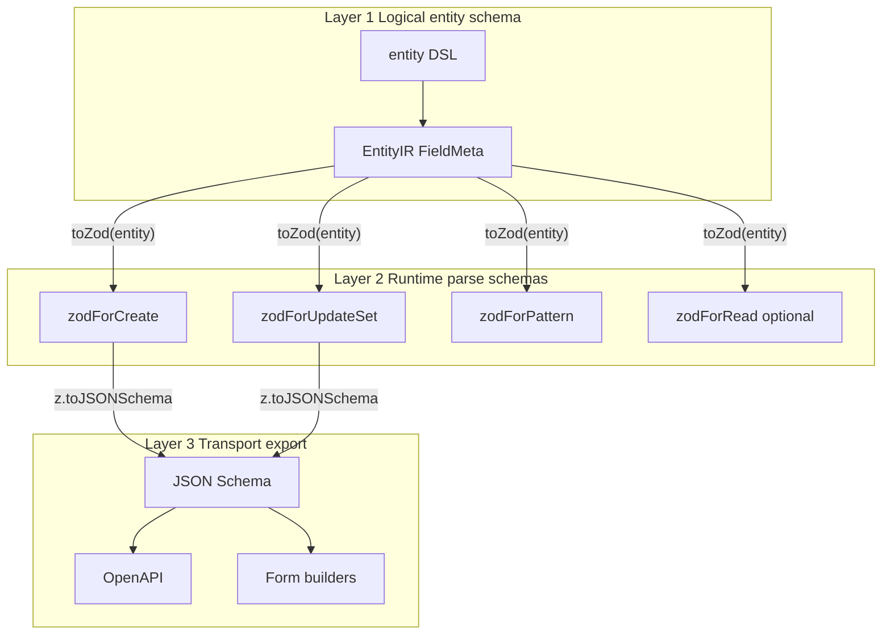

# Validation boundary

This doc defines where runtime validation lives in the patternmesh ecosystem
and, more importantly, where it does **not**. It is the architectural target
for any future `@patternmeshjs/zod` (or `@patternmeshjs/valibot`) adapter and
for the `@patternmeshjs/testing` integration path.

TL;DR: **the core DSL and compiler are the source of truth; any validation
library is an optional adapter that is generated from the DSL, never the
reverse.**

## Positions

### 1. `@patternmeshjs/core` stays zero-dep on any validation library

`core` declares entities, compiles keys, plans access patterns, and renders
explain output. It owns the strict-shape check that rejects unknown keys on
`create` / `update`, the required/enum/scalar validation driven by
`FieldMeta`, and the error taxonomy (`ValidationError`,
`ConditionFailedError`, `NotUniqueError`). None of that requires `zod`,
`valibot`, `yup`, or anything similar.

Adding a validation library as a direct dependency of `core` would:

- couple the compiler to an external schema format's evolution
- force consumers to pay for a validation runtime even when they do not want
  runtime validation (e.g. already-validated transport boundaries)
- make it impossible to offer a competing integration later

This is a hard rule. Any PR that adds a non-trivial validation runtime to
`core` should be blocked.

### 2. The entity DSL is the source of truth

`entity(...).keys(...).index(...).identity(...).accessPatterns(...)` owns:

- identity fields and mutability rules (`immutable()`, `version()`)
- `FieldMeta` for every attribute — the drivers of `Settable`, `Addable`,
  `RemovableKeys`, and `ConditionShape` type synthesis
- physical-key compilation and GSI routing
- access-pattern shape and input typing
- explain-plan generation

Anything downstream — runtime parsers, JSON Schema exports, API-boundary
validators — is **derived** from the DSL. A consumer who authors with the
DSL gets all of these for free. A consumer who writes `z.object({...})`
first and tries to wire it back into the DSL **will not** get correct key
compilation, because Zod does not know what a sort key is.

### 3. Validation adapters own parse, normalize, and export

A validation adapter package (e.g. a future `@patternmeshjs/zod`) owns, at
most:

- **parse** — strict runtime checking of `create` input, `update().set()`
  payloads, and access-pattern inputs at the API boundary
- **normalize** — trim/lowercase/coerce transforms that happen before the
  compiler sees the data
- **defensive reads** — optional `.parse()` of returned items to catch
  corrupt data in the table (useful during migrations)
- **export** — emit JSON Schema or OpenAPI from the same source of truth, for
  docs generation, form builders, and AI / structured-output tooling

It does **not** own:

- key compilation (lives in `core`)
- access-pattern planning (lives in `core`)
- mutability rules (lives in `FieldMeta`)
- DynamoDB expression generation (lives in `update.ts` /
  `access-pattern-factory.ts`)

## The three-layer schema model

Every consumer sees at most three schema layers:



### Layer 1 — logical entity schema

Owned by `@patternmeshjs/core`. Drives TS inference, key planning,
repository surface, update mutability rules.

### Layer 2 — runtime parse schemas

Owned by the validation adapter. Generated from Layer 1. Separate schemas
for each boundary: `create`, `update().set()`, each named access pattern,
optional reads.

### Layer 3 — transport / export schemas

Derived from Layer 2 via Zod 4's `z.toJSONSchema(...)` (or an equivalent in
another adapter). Consumed by docs tooling, form generators, OpenAPI, and AI
tooling.

## Recommended API shape for `@patternmeshjs/zod`

This is the target API. It is **not yet implemented** — this section exists
so the first PR that builds `@patternmeshjs/zod` has a concrete target.

```ts
import { toZod, zodForCreate, zodForUpdateSet, zodForPattern } from "@patternmeshjs/zod";

const UserCreateSchema = zodForCreate(User);
const UserUpdateSetSchema = zodForUpdateSet(User);
const UserByEmailInputSchema = zodForPattern(User, "byEmail");

const parsed = UserCreateSchema.parse(input);
await db.User.create(parsed);
```

Optional higher-level integration:

```ts
await db.User.create(input, { validateWithZod: true });
await db.User.find.byEmail(input, { validateWithZod: true });
```

### Authoring still happens in the DSL

```ts
const User = entity("User", {
  userId: id("usr").required().immutable(),
  orgId: id("org").required().immutable(),
  email: string()
    .required()
    .normalize((v) => v.trim().toLowerCase()),
  name: string().optional(),
  status: enumType(["active", "disabled"]).default("active"),
  createdAt: datetime().defaultNow().immutable(),
})
  .keys(({ userId }) => ({ pk: key("USER", userId), sk: key("PROFILE") }))
  .index("GSI1", ({ email }) => ({
    gsi1pk: key("EMAIL", email),
    gsi1sk: key("USER"),
  }))
  .accessPatterns((ap) => ({
    byId: ap.get(({ userId }) => ({
      pk: key("USER", userId),
      sk: key("PROFILE"),
    })),
    byEmail: ap.unique("GSI1", ({ email }) => ({
      pk: key("EMAIL", email),
      sk: key("USER"),
    })),
  }));
```

The DSL expresses `immutable`, `normalize`, `defaultNow`, `enumType`, and
identity in ways that map cleanly onto Zod. The reverse is not true — Zod
does not know what a sort key is or which fields participate in identity.

## Anti-patterns (blocking review)

### Do not make Zod the primary authoring path

```ts
const UserSchema = z.object({...});
const User = entityFromZod(UserSchema).keys(...).accessPatterns(...); // no
```

This forces DynamoDB-specific semantics (identity, mutability, key
composition, access-pattern kinds) into Zod transforms, which cannot
represent them without custom `.meta()` conventions that re-invent the DSL.
The DSL already exists; use it.

### Do not hide storage semantics inside a Zod transform

```ts
const UserSchema = z.object({
  email: z.string().transform((v) => ({
    pk: `USER#${userId}`, // no — key compilation is core's job
    sk: "PROFILE",
  })),
});
```

Key compilation lives in `core`. Transforms that produce `pk` / `sk` strings
from input are a category error.

### Do not let mutability live in Zod

```ts
const UserUpdateSchema = z.object({
  userId: z.never(), // no — immutability is FieldMeta, not a Zod constraint
});
```

`immutable()` on a field builder is the contract. The generated
`zodForUpdateSet` schema will omit the field automatically. Don't hand-roll
`z.never()` to enforce it.

### Do not parse read-path output by default

Read-path parsing is an opt-in defensive measure during migrations or when
consuming from an untrusted writer. Making it default adds cost and hides
data-quality problems. Default to trusting what the compiler round-tripped.

## Alignment with adjacent packages

- **`@patternmeshjs/testing`** uses the same entity DSL to seed fixtures and
  assert compiled plans. It does not need Zod; it needs `core`'s
  explain/compiler surface.
- **`@patternmeshjs/devtools`** visualizes compiled plans. Same — no Zod
  dependency.
- **`@patternmeshjs/migrations`** operates over the compiled IR. No Zod
  dependency.

If an adjacent package is tempted to import `zod` directly, that is a signal
it should instead take Zod as an optional integration via
`@patternmeshjs/zod` once that package exists.

## See also

- [ROADMAP.md](../../ROADMAP.md) "Adjacent packages" — where
  `@patternmeshjs/zod` sits in the sequence.
- [Repo architecture § hard rules](./repo-architecture.md#hard-rules) — why
  `core` stays zero-dep on external libraries.
- [Adding a package](./adding-a-package.md) — the scaffold a new validation
  adapter would use.
